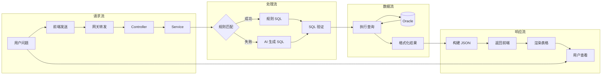
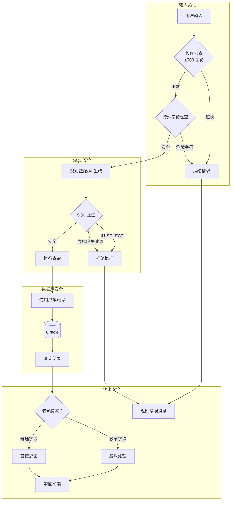

# 智问系统核心流程泳道图

## 📊 整体架构泳道图

```mermaid
swDiagram
  %% 智问系统核心流程 - 泳道图
  %% 创建时间：2026-04-14
  
  subgraph 用户层
    U1[用户提问] --> U2[查看结果]
  end
  
  subgraph 前端层 (REPORTUI)
    F1[SmartQuery.vue] --> F2[发送 HTTP 请求]
    F2 --> F3[解析响应数据]
    F3 --> F4[渲染消息气泡]
    F4 --> F5[显示表格/SQL]
  end
  
  subgraph 网关层
    G1[Nginx/跨域] --> G2[请求转发]
  end
  
  subgraph 后端层 (REPORT Service)
    B1[NLQueryController] --> B2[NLQueryService.query()]
    B2 --> B3{规则匹配？}
    B3 -->|是 | B4[匹配 NL_QUERY_RULES]
    B3 -->|否 | B5[返回"不理解问题"]
    B4 --> B6[提取参数]
    B6 --> B7[替换 SQL 参数]
    B7 --> B8[执行 SQL 查询]
    B8 --> B9[返回查询结果]
  end
  
  subgraph 数据层 (Oracle)
    D1[(NL_QUERY_RULES 表)] --> D2[(业务数据表)]
    D2 --> D3[DCP_SALE/DCP_STOCK 等]
  end
  
  %% 流程连接
  U1 --> F1
  F2 --> G1
  G2 --> B1
  B9 --> F3
  F5 --> U2
  D1 --> B3
  D2 --> B8
```

---

## 🔄 详细流程泳道图（带扩展方案）

```mermaid
swDiagram
  %% 智问系统详细流程 - 含 AI 扩展方案
  
  subgraph 用户
    Start((开始)) --> InputQuestion[输入自然语言问题]
    ShowResult[查看查询结果] --> End((结束))
  end
  
  subgraph 前端 REPORTUI
    InputQuestion --> SendMessage[发送 POST 请求]
    SendMessage --> ShowLoading[显示"AI 思考中..."]
    ReceiveResponse[接收响应] --> ParseData[解析数据]
    ParseData --> RenderTable[渲染表格/消息]
    RenderTable --> ShowResult
  end
  
  subgraph 后端 REPORT Service
    ShowLoading --> NLController[NLQueryController.query()]
    NLController --> NLService[NLQueryService.query()]
    NLService --> MatchRule{规则匹配？}
    
    MatchRule -->|关键词匹配成功 | GetRule[获取 NL_QUERY_RULES 记录]
    MatchRule -->|无匹配规则 | AIExtension{AI 扩展？}
    
    GetRule --> ExtractParams[提取参数 (如品号)]
    ExtractParams --> ReplaceSQL[替换 SQL 参数]
    ReplaceSQL --> ValidateSQL{SQL 验证}
    
    ValidateSQL -->|安全 | ExecuteSQL[执行 SQL 查询]
    ValidateSQL -->|危险 | ReturnError[返回错误]
    
    AIExtension -->|启用 | CallAI[调用通义千问 API]
    AIExtension -->|未启用 | ReturnUnknown[返回"不理解问题"]
    
    CallAI --> GenerateSQL[AI 生成 SQL]
    GenerateSQL --> ValidateSQL
    
    ExecuteSQL --> FormatResult[格式化结果]
    FormatResult --> BuildResponse[构建响应 JSON]
    BuildResponse --> ReceiveResponse
    ReturnError --> ReceiveResponse
    ReturnUnknown --> ReceiveResponse
  end
  
  subgraph 数据库 Oracle
    GetRule -.-> QueryRules[(NL_QUERY_RULES)]
    ExecuteSQL -.-> QueryData[(DCP_SALE<br/>DCP_STOCK<br/>DCP_ORG_LANG 等)]
  end
  
  subgraph 外部 AI 服务
    CallAI -.-> DashScope[通义千问 API<br/>qwen-plus 模型]
  end
  
  Start --> InputQuestion
  End --> ShowResult
```

---

## 🎯 规则匹配流程（第一阶段）

```mermaid
flowchart TD
    A[用户提问] --> B{问题包含关键词？}
    B -->|是 | C[匹配 NL_QUERY_RULES 表]
    B -->|否 | D[返回"抱歉，我不理解这个问题"]
    
    C --> E{找到匹配规则？}
    E -->|是 | F[获取 SQL 模板]
    E -->|否 | D
    
    F --> G[提取参数<br/>如：商品品号 PLUNO]
    G --> H[替换 SQL 参数<br/>:PLUNO → '001']
    
    H --> I{SQL 安全检查}
    I -->|通过 | J[执行 SQL 查询]
    I -->|失败 | K[返回"查询失败"]
    
    J --> L{查询成功？}
    L -->|是 | M[格式化结果为表格]
    L -->|否 | K
    
    M --> N[返回 JSON 响应<br/>success + data + sql]
    K --> N
    D --> N
    
    N --> O[前端渲染消息气泡]
    O --> P[显示 SQL 代码块<br/>可选]
    P --> Q[显示数据表格]
```

---

## 🤖 AI 辅助流程（第二阶段扩展）

```mermaid
flowchart TD
    A[规则匹配失败] --> B{AI 扩展已启用？}
    B -->|否 | C[返回"不理解问题"]
    B -->|是 | D[调用 SchemaService]
    
    D --> E[读取表结构元数据]
    E --> F[构建 Prompt<br/>表结构 + 用户问题]
    
    F --> G[调用通义千问 API]
    G --> H{API 调用成功？}
    H -->|否 | I[返回"AI 服务暂时不可用"]
    H -->|是 | J[获取 AI 生成的 SQL]
    
    J --> K{SQL 安全验证}
    K -->|包含危险操作 | L[拒绝执行<br/>DROP/DELETE/UPDATE 等]
    K -->|仅 SELECT| M[使用只读账号执行 SQL]
    
    L --> N[返回"SQL 验证失败"]
    M --> O{执行成功？}
    O -->|是 | P[格式化结果]
    O -->|否 | Q[返回执行错误]
    
    P --> R[返回响应]
    Q --> R
    N --> R
    I --> R
    C --> R
```

---

## 📁 数据流图



---

## 🔐 安全机制泳道图



---

## 📋 核心数据表结构

### NL_QUERY_RULES 表

| 字段名 | 类型 | 说明 | 示例 |
|--------|------|------|------|
| RULE_ID | VARCHAR2(36) | 规则 ID（主键） | RULE_001 |
| RULE_NAME | VARCHAR2(100) | 规则名称 | 今日销售额 |
| KEYWORDS | VARCHAR2(500) | 关键词（逗号分隔） | 今天，今日，销售额 |
| SQL_TEMPLATE | VARCHAR2(2000) | SQL 模板 | SELECT SUM(...) FROM... |
| PARAMS | VARCHAR2(500) | 参数说明 | PLUNO:商品品号 |
| ENABLED | CHAR(1) | 是否启用 | Y/N |
| SORT_ORDER | NUMBER | 排序（小的优先） | 1,2,3... |
| CREATED_TIME | DATE | 创建时间 | 2026-04-13 |
| UPDATED_TIME | DATE | 更新时间 | 2026-04-13 |

---

## 🎨 前端组件结构

```
SmartQuery.vue
├── chat-header          # 聊天头部（标题 + 副标题）
├── chat-messages        # 消息容器
│   ├── welcome-message  # 欢迎消息（无历史消息时显示）
│   │   └── example-questions  # 示例问题按钮
│   ├── message.user     # 用户消息气泡
│   ├── message.bot      # 机器人消息气泡
│   │   ├── sql-block    # SQL 代码块（可选显示）
│   │   └── data-table   # 数据表格
│   └── message.loading  # 加载状态
└── chat-input           # 输入框 + 发送按钮
```

---

## 🚀 API 接口规范

### 请求格式

```http
POST /api/nl-query/query
Content-Type: application/x-www-form-urlencoded

question=今天销售额是多少？
```

### 响应格式

**成功响应：**
```json
{
  "success": true,
  "data": [
    { "TOTAL": 12345.67 }
  ],
  "ruleName": "今日销售额",
  "question": "今天销售额是多少？",
  "sql": "SELECT NVL(SUM(SALE_QTY * SALE_PRICE), 0) AS TOTAL..."
}
```

**失败响应：**
```json
{
  "success": false,
  "message": "抱歉，我不理解这个问题。试试问：今天销售额是多少？"
}
```

---

## 📝 示例问题库

| 分类 | 示例问题 | 匹配关键词 |
|------|----------|------------|
| 销售额 | 今天销售额是多少？ | 今天，今日，销售额 |
| 销售额 | 本月销售额是多少？ | 本月，这个月，销售额 |
| 销量 | 商品 001 卖了多少？ | 销量，卖了多少 |
| 库存 | 商品 001 还有库存吗？ | 库存，还有多少 |
| 排行 | 哪个商品卖得最好？ | 排行，最畅销，卖得最好 |
| 门店 | A 门店今天销售如何？ | 门店，销售 |

---

*文档生成时间：2026-04-14*  
*创建者：龙虾 AI 助手 🦞*
