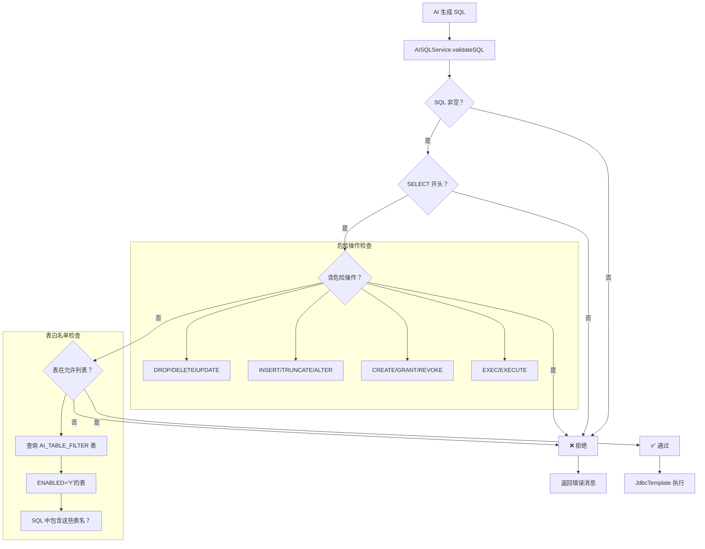

# 智问核心流程泳道图（实际代码实现版）

> 基于现有代码分析 · 2026-04-14

---

## 📊 整体流程泳道图

```mermaid
flowchart TD
  subgraph 用户
    Start((开始)) --> Input[输入自然语言问题]
    ShowResult[查看结果] --> End((结束))
  end
  
  subgraph 前端 REPORTUI
    Input --> SendReq[SmartQuery.vue send 方法]
    SendReq --> ShowLoad[显示 AI 思考中...]
    ShowLoad --> PostAPI[POST /api/nl-query/query<br/>question=xxx]
    PostAPI --> WaitResp[等待响应]
    WaitResp --> ParseJSON[解析响应 JSON]
    ParseJSON --> RenderTable[渲染 Markdown 表格]
    RenderTable --> ShowSQL[显示 SQL 代码块]
    ShowSQL --> ShowResult
  end
  
  subgraph 后端 REPORT Service
    PostAPI --> NLController[NLQueryController.query<br/>@PostMapping /query]
    NLController --> NLService[NLQueryService.query]
    NLService --> AISQL[AISQLService.generateSQL]
    
    AISQL --> GetSchema[SchemaService.getAllTables]
    GetSchema --> QueryFilter[查询 AI_TABLE_FILTER 表<br/>获取启用的表列表]
    QueryFilter --> BuildPrompt[构建 Prompt]
    BuildPrompt --> CallAI[调用通义千问 API<br/>qwen-plus 模型]
    CallAI --> CleanSQL[清理 SQL<br/>移除 markdown 标记]
    CleanSQL --> Validate[AISQLService.validateSQL]
    
    Validate --> CheckSelect{是否 SELECT 开头？}
    CheckSelect -->|否 | Reject[拒绝执行]
    CheckSelect -->|是 | CheckDanger{含危险操作？}
    
    CheckDanger -->|是 | Reject
    CheckDanger -->|否 | CheckTable{表在允许列表？}
    
    CheckTable -->|否 | Reject
    CheckTable -->|是 | Execute[JdbcTemplate.queryForList]
    
    Execute --> BuildResp[构建响应 JSON<br/>success + data + sql]
    BuildResp --> WaitResp
    Reject --> ErrorResp[构建错误响应<br/>success=false + message]
    ErrorResp --> WaitResp
  end
  
  subgraph 数据库 Oracle
    QueryFilter -.-> AITable[(AI_TABLE_FILTER)]
    GetSchema -.-> MetaData[(USER_TAB_COLUMNS<br/>USER_COL_COMMENTS)]
    Execute -.-> BizData[(DCP_SALE 等业务表)]
  end
  
  subgraph 外部 AI 服务
    CallAI -.-> DashScope[通义千问 API<br/>dashscope.aliyuncs.com]
  end
  
  Start --> Input
  End --> ShowResult
```

---

## 🔄 详细调用链

```
用户提问
   │
   ▼
┌─────────────────────────────────────────┐
│  前端：SmartQuery.vue                   │
│  send() 方法                            │
│  POST /api/nl-query/query               │
└─────────────────┬───────────────────────┘
                  │
                  ▼
┌─────────────────────────────────────────┐
│  后端：NLQueryController                │
│  @PostMapping("/query")                 │
│  query(@RequestParam String question)   │
└─────────────────┬───────────────────────┘
                  │
                  ▼
┌─────────────────────────────────────────┐
│  后端：NLQueryService                   │
│  query(question)                        │
│  → aiSQLService.generateSQL(question)   │
└─────────────────┬───────────────────────┘
                  │
                  ▼
┌─────────────────────────────────────────┐
│  后端：AISQLService                     │
│  generateSQL(question)                  │
│  1. schemaService.getAllTables()        │
│  2. buildPrompt(schema, question)       │
│  3. callAI(prompt)                      │
│  4. cleanSQL(sql)                       │
└─────────────────┬───────────────────────┘
                  │
                  ▼
┌─────────────────────────────────────────┐
│  后端：SchemaService                    │
│  getAllTables()                         │
│  1. 查询 AI_TABLE_FILTER 表             │
│  2. 遍历每个表，查询 USER_TAB_COLUMNS   │
│  3. 查询 USER_COL_COMMENTS 获取注释     │
│  4. 返回 Markdown 格式表结构            │
└─────────────────┬───────────────────────┘
                  │
                  ▼
┌─────────────────────────────────────────┐
│  外部：通义千问 API                     │
│  POST /api/v1/services/aigc/...         │
│  Model: qwen-plus                       │
│  返回：SQL 语句                         │
└─────────────────┬───────────────────────┘
                  │
                  ▼
┌─────────────────────────────────────────┐
│  后端：AISQLService                     │
│  validateSQL(sql)                       │
│  1. 检查是否 SELECT 开头                │
│  2. 检查危险关键词                      │
│  3. 检查表是否在 AI_TABLE_FILTER 中     │
└─────────────────┬───────────────────────┘
                  │
                  ▼
┌─────────────────────────────────────────┐
│  后端：JdbcTemplate                     │
│  queryForList(sql)                      │
│  执行查询，返回 List<Map>               │
└─────────────────┬───────────────────────┘
                  │
                  ▼
┌─────────────────────────────────────────┐
│  后端：NLQueryService                   │
│  构建响应 JSON:                         │
│  {                                      │
│    success: true,                       │
│    sql: "...",                          │
│    data: [...],                         │
│    question: "...",                     │
│    rowCount: N                          │
│  }                                      │
└─────────────────┬───────────────────────┘
                  │
                  ▼
┌─────────────────────────────────────────┐
│  前端：SmartQuery.vue                   │
│  解析响应，渲染表格                     │
│  addMessage(content, 'bot', data.sql)   │
└─────────────────────────────────────────┘
```

---

## 🔐 安全验证流程



---

## 📁 核心数据表

### AI_TABLE_FILTER 表
```sql
-- 用于控制 AI 可以访问的表
SELECT TABLE_NAME, TABLE_COMMENT, ENABLED, SORT_ORDER 
FROM AI_TABLE_FILTER 
WHERE ENABLED = 'Y' 
ORDER BY SORT_ORDER;
```

| 字段 | 类型 | 说明 |
|------|------|------|
| TABLE_NAME | VARCHAR2 | 表名 |
| TABLE_COMMENT | VARCHAR2 | 表注释（用于 Prompt） |
| ENABLED | CHAR(1) | 是否启用 Y/N |
| SORT_ORDER | NUMBER | 排序 |

### 数据库元数据表（Oracle 系统表）
```sql
-- 获取表列信息
SELECT COLUMN_NAME, DATA_TYPE, DATA_LENGTH, NULLABLE 
FROM USER_TAB_COLUMNS 
WHERE TABLE_NAME = ? 
ORDER BY COLUMN_ID;

-- 获取列注释
SELECT COMMENTS 
FROM USER_COL_COMMENTS 
WHERE TABLE_NAME = ? AND COLUMN_NAME = ?;
```

---

## 🚀 API 接口

### 请求
```http
POST http://47.100.138.89:8110/api/nl-query/query
Content-Type: application/x-www-form-urlencoded

question=今天销售额是多少？
```

### 成功响应
```json
{
  "success": true,
  "sql": "SELECT NVL(SUM(SALE_QTY * SALE_PRICE), 0) AS TOTAL FROM DCP_SALE WHERE...",
  "data": [
    { "TOTAL": 12345.67 }
  ],
  "question": "今天销售额是多少？",
  "rowCount": 1
}
```

### 失败响应
```json
{
  "success": false,
  "message": "生成的 SQL 不安全，已拒绝执行：DROP TABLE..."
}
```

---

## 🎨 前端组件结构

```
SmartQuery.vue
├── data()
│   ├── question: ''           # 输入框内容
│   ├── loading: false         # 加载状态
│   ├── messages: []           # 消息列表
│   └── examples: [...]        # 示例问题
│
├── methods
│   ├── send()                 # 发送请求
│   │   ├── POST /api/nl-query/query
│   │   ├── 显示 loading
│   │   ├── 解析响应
│   │   └── 渲染表格/SQL
│   │
│   ├── addMessage()           # 添加消息
│   │   └── {type, content, sql, time}
│   │
│   ├── formatContent()        # 格式化内容
│   │   └── Markdown 表格 → HTML
│   │
│   └── askExample()           # 示例问题
│
└── template
    ├── chat-header            # 头部
    ├── chat-messages          # 消息容器
    │   ├── welcome-message    # 欢迎消息
    │   ├── message.user       # 用户消息
    │   ├── message.bot        # 机器人消息
    │   │   ├── sql-block      # SQL 代码块
    │   │   └── data-table     # 数据表格
    │   └── message.loading    # 加载中
    └── chat-input             # 输入框
```

---

## 🧠 Prompt 构建逻辑

```java
private String buildPrompt(String schema, String question) {
    return """
    你是一个专业的 Oracle SQL 专家，请根据以下数据库表结构，
    将用户的自然语言问题转换为 Oracle SQL 查询。
    
    ## 数据库表结构
    """ + schema + """
    
    ## 用户问题
    """ + question + """
    
    ## 要求
    
    1. 只返回 SQL 语句，不要任何解释
    2. 只使用 SELECT 语句，禁止使用 INSERT、UPDATE、DELETE、DROP 等
    3. 使用 Oracle 语法（如 NVL、TRUNC、TO_CHAR、TO_DATE 等）
    4. 如果问题不明确，返回最简单的查询
    5. 确保 SQL 可以执行
    6. 只查询必要的字段，不要 SELECT *
    7. 日期字段如果是字符串类型，使用 TO_DATE 转换
    8. 使用 TRUNC(SYSDATE) 表示今天
    9. 聚合查询使用 NVL 处理 NULL 值
    
    ## SQL
    """;
}
```

---

## 🔑 API Key 获取

```java
private String getApiKey() {
    String sql = "SELECT ACCESSKEYSECRET FROM PRODUCT_APPKEY WHERE PLATFORM = 'ALI_QWEN'";
    List<Map<String, Object>> list = jdbcTemplate.queryForList(sql);
    if (list != null && !list.isEmpty()) {
        return (String) list.get(0).get("ACCESSKEYSECRET");
    }
    return null;
}
```

**配置位置：** `PRODUCT_APPKEY` 表  
**条件：** `PLATFORM = 'ALI_QWEN'`  
**字段：** `ACCESSKEYSECRET`

---

## 📝 关键代码文件

| 文件 | 说明 |
|------|------|
| `REPORTUI/src/views/SmartQuery.vue` | 前端聊天界面 |
| `REPORT/src/main/java/com/report/controller/NLQueryController.java` | 控制器 |
| `REPORT/src/main/java/com/report/service/NLQueryService.java` | 服务层 |
| `REPORT/src/main/java/com/report/service/AISQLService.java` | AI SQL 生成 |
| `REPORT/src/main/java/com/report/service/SchemaService.java` | 表结构服务 |

---

*文档生成时间：2026-04-14*  
*创建者：龙虾 AI 助手 🦞*
