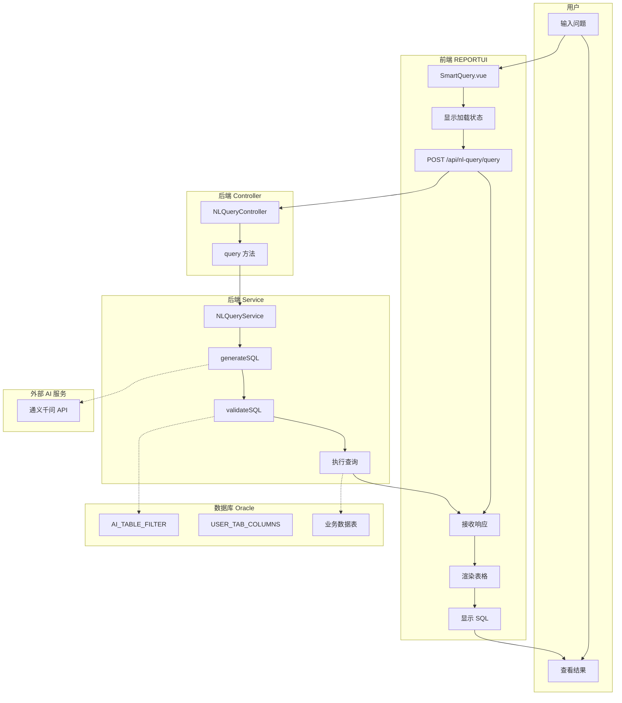
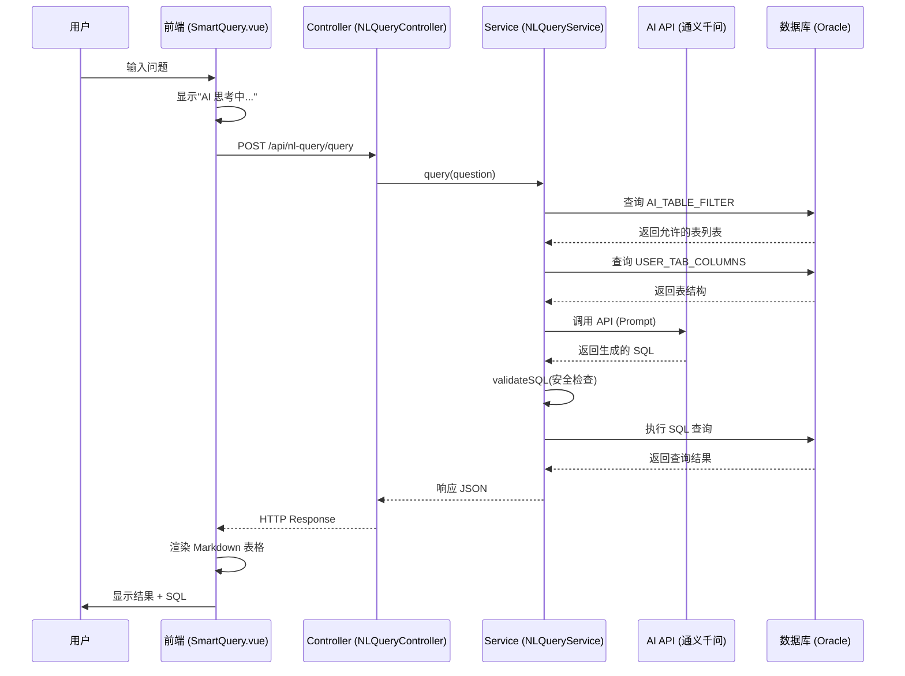

# 智问系统泳道图（Swimlane Diagram）

> 泳道图核心：每个步骤都要明确**谁**在做什么

---

## 🏊 泳道图说明

泳道图与普通流程图的区别：
- **泳道图**：按角色/系统分区，每个步骤放在对应的泳道中
- **普通流程图**：只展示步骤顺序，不强调责任归属

---

## 📊 智问核心流程泳道图

---

## 📋 泳道职责表

| 泳道 | 职责 | 关键文件/组件 |
|------|------|---------------|
| **用户** | 输入问题、查看结果 | - |
| **前端 REPORTUI** | 界面展示、HTTP 请求、结果渲染 | SmartQuery.vue |
| **后端 Controller** | 接收 HTTP 请求、参数校验 | NLQueryController.java |
| **后端 Service** | SQL 生成、安全验证、执行查询 | NLQueryService.java, AISQLService.java |
| **外部 AI 服务** | 根据 Prompt 生成 SQL | 通义千问 API |
| **数据库 Oracle** | 提供表结构、存储业务数据 | AI_TABLE_FILTER, DCP_SALE 等 |

---

## 🔄 带时间轴的泳道图

---

## 🎯 关键交互点

| 交互点 | 发起方 | 接收方 | 内容 |
|--------|--------|--------|------|
| 1 | 用户 → 前端 | 输入自然语言问题 |
| 2 | 前端 → Controller | HTTP POST 请求 |
| 3 | Controller → Service | 调用 query() 方法 |
| 4 | Service → 数据库 | 查询表结构元数据 |
| 5 | Service → AI API | 调用通义千问生成 SQL |
| 6 | Service → Service | validateSQL 安全验证 |
| 7 | Service → 数据库 | 执行生成的 SQL |
| 8 | Service → 前端 | 返回 JSON 响应 |
| 9 | 前端 → 用户 | 渲染结果展示 |

---

## 📁 文件映射

| 泳道 | 文件路径 |
|------|----------|
| 前端 | `/home/admin/.openclaw/workspace/REPORTUI/src/views/SmartQuery.vue` |
| Controller | `/home/admin/.openclaw/workspace/REPORT/src/main/java/com/report/controller/NLQueryController.java` |
| Service | `/home/admin/.openclaw/workspace/REPORT/src/main/java/com/report/service/NLQueryService.java` |
| AI Service | `/home/admin/.openclaw/workspace/REPORT/src/main/java/com/report/service/AISQLService.java` |
| Schema Service | `/home/admin/.openclaw/workspace/REPORT/src/main/java/com/report/service/SchemaService.java` |

---

*文档生成时间：2026-04-14*
